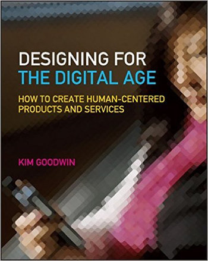

# Course Syllabus: DMS 104 - Design in the Digital Age

Designing digital artifacts requires a process of "Interaction Design" which is a wholly new discipline that moves beyond previous fads of simply making digital things that look like physical world objects. Since there is no known formula for creating great UI/UX we will explore the need to consider interactivity as **a design process**, moving from initial ethnographic research through ideation and design, and the many steps that lead to final delivery and presentation. 

Mastery of this process prepares DMS students to undertake their senior capstone project as well as effectively develop other creative and entrepreneurial ideas/ventures.

- Section: **DMS 104-1**

- Title: **Design in the Digital Age**

- Credits: **4.0**

- Schedule: **Tuesdays and Thursdays at 12:30 PM EST** with support for **real-time** (synchronous) and **delayed** (asynchronous) participation (details in the [*Participation*](#participation) section, below)

## Course Information and Announcements

- All **course documentation** and **assignments** for DMS 104 is published here: **[docs.dms104.org](http://docs.dms104.org/)**, not in Blackboard
- All **announcements** for DMS 104 is distributed via "Slack" - an online communication and collaboration tool, not in Blackboard

  - Students are required to **create a Slack account here**: [ join.slack.com/t/dms104/signup](https://join.slack.com/t/dms104/signup) and then monitor the DMS 104 Slack Workspace here: **[dms104.slack.com](https://dms104.slack.com/)** throughout the semester.
    - When registering for an account in Slack, students must use their **rochester.edu** email
    - Suggestion: after students setup their Slack account, instead of using Slack via the website, **install the device software**: [slack.com/downloads](https://slack.com/downloads)
- **Blackboard** is used by students to turn-in assignments and monitor their grade progress only throughout the semester

## Instructor Information

- Instructor: **Professor Kostin** Instructional Faculty Digital Media Studies Program; Computer Science Department University of Rochester 206a Morey Hall (private office); 2105 Wegmans Hall (shared office)
- **Messaging/Office Hours**
  - e-mail: **<robert.kostin@rochester.edu>** - not recommended due to excessive incoming messages, instead...
  - For faster reply, please use **Slack** to [send a DM to Professor Kostin](https://app.slack.com/client/T01HUPHAT6F/D01HUHFFC3U)
  - For real-time discussions about non-technical matters (**office hours**), schedule an appointment using [**Calendly**, an online scheduling app](https://calendly.com/rkostin) to setup a private Zoom meeting

## Grading

A grading rubric is provided for each assignment. Rubrics inform students how assignments are evaluated. In the interest of fairness, extra credit and make-up work is not offered.

### Grading Schema

| **Range**      | **Grade** |
| -------------- | --------- |
| 93.00 to 100   | A         |
| 90.00 to 92.99 | A-        |
| 87.00 to 89.99 | B+        |
| 84.00 to 86.99 | B         |
| 80.00 to 83.99 | B-        |
| 77.00 to 79.99 | C+        |
| 74.00 to 76.99 | C         |
| 70.00 to 73.99 | C-        |
| 67.00 to 69.99 | D+        |
| 64.00 to 66.99 | D         |
| 60.00 to 63.99 | D-        |
| 00.00 to 59.99 | E         |

| Activity                                                     | Weight of the final grade                                    |
| ------------------------------------------------------------ | ------------------------------------------------------------ |
| **Participation and Checkpoint Deliverables**  All along the process of design there are opportunities for students to submit "checkpoint deliverables" and to participate in workshop activities that keep the design teams on track for successful project delivery | **35%** There are multiple opportunities for students working in teams and as individuals to get credit for their ongoing work in support of the projects |
| **Projects** Students design an interactive digital artifact in four parts over the course of the semester  Project 1 - Marketing Requirements Document Project 2 - User and Domain Analysis Project 3 - Design Vision Project 4 - Form & Behavior Specification (and Detailed Design) | **65%** The four parts of the design process require students to work in  teams to deliver each project  **10%** **25%** **15%** **15%** |

*Note: there are no exams in DMS 104; the results of the projects are the primary assessment tool to determine the student's proficiency with the course material*

### Participation

The design of this course follows a "flipped" structure that requires students to learn basic concepts as assigned *outside the classroom*, and participate in workshops and group activities during the classroom sessions. Attendance is counted as "participation" and is required for success in the course.

Outside of the classroom sessions, students need to: read/study assigned sections of the book; coordinate with other students to work on assignments; and be ever vigilant looking for and responding to announcements from the professor.

- As scheduled, students are required to watch pre-recorded lectures ([via Panopto](https://rochester.hosted.panopto.com/Panopto/Pages/Sessions/List.aspx#folderID=%22cceb7b63-7c08-498e-885a-ac770014a7bd%22)) and to participate in real-time discussions (via Zoom)

- Pre-recorded lectures must be watched by students within 24 hours of publication

- Real-time discussions are conducted via Zoom and are recorded; if a student is unable to attend a discussion in real-time they must watch the recorded discussion (in Panopto) within 24 hours of publication

  *Students who neglect to watch the lecture videos on-time and/or neglect to participate in discussions or watched recorded discussions on-time, will loose points due to lack of participation, and they will be denied help when asked, and will receive neither flexibility with due dates nor a chance to get assignments re-graded*

## Texts and Materials

*Required:* **Designing for the Digital Age**
by Kim Goodwin & Alan Cooper
ISBN: 9780470229101

Get [the text book from the UR Bookstore here](https://urochester.bncollege.com/shop/urochester/textbook/designing-for-digital-age?sectionId=100561412&displayStoreId=27055&sectionList=&booksAddedforSec=&fromTBList=true)

©2009 by Kim Goodwin
Wiley Publishing, Inc.
ISBN:978-0-470-22910-1

## Assignments

Students are required to read the book as scheduled and take good book notes (ungraded) and learn from from the book appropriately (obviously).

In addition to reading the book as assigned, other activities ("checkpoint deliverables") are required as scheduled.  The purpose of these other activities are to promote participation and to ensure students are on-track to deliver the projects, which are critical to success in the course.

### Due Dates

For each assignment, the **due date** is shown near the top of its instruction sheet. To avoid a zero grade, each must be turned-in via Blackboard on or before its due date.

### Late assignments

<u>Late assignments will not be graded</u> unless a prior arrangement has been made with the professor for an **extension by one or two days**. Extensions will only be granted two or three times, maximum, per semester, at the discretion of the professor.

The grade for assignments not turned-in on time with no prior arrangement for an extension will be zero.

## Academic Honesty

Violation of the College's Honesty Policy is a serious violation of the trust upon which our academic community depends. A common form of academic dishonesty is plagiarism: the representation of another person's work as one's own, or the attempt "to blur the line between one's own ideas or words and those borrowed from another source." ([Council of Writing Program Administrators, January 2003, published online December 2019](http://wpacouncil.org/aws/CWPA/pt/sd/news_article/272555/_PARENT/layout_details/false)). In cases where plagiarism is evident, the University's rules governing academic dishonesty will be followed. As required by College policy, all instances of plagiarism are reported to the College Board of Academic Honesty. For the complete College honesty policy, see: [www.rochester.edu/college/honesty](http://www.rochester.edu/college/honesty)

## Academic Assistance and Accommodations

Please know that this classroom respects and welcomes students of all backgrounds and abilities. Students are invited to talk with the professor about any concern or situation that affects their ability to complete their academic work successfully. Useful resources for all students include the Center for Excellence in Teaching and Learning, located at **1-154 Dewey Hall** on the River Campus; telephone: **(585) 275-9049** or email [cetl@rochester.edu](mailto:cetl@rochester.edu)

## Schedule

This [schedule (linked here)](https://docs.dms104.org/schedule.html) is subject to modification throughout the semester. Always check with the professor to answer questions about the schedule.